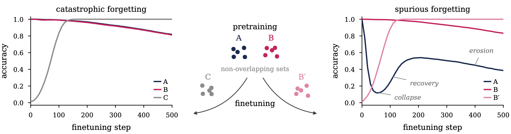

<div align="center">

# When Forgetting Is Not Catastrophic: On the Mechanics of Spurious Forgetting

**Vedant Palit**<sup>1,2,3</sup>, **Florent Draye**<sup>1,4</sup>, **Nicolas Zucchet**<sup>5</sup>, **Zhijing Jin**<sup>1,2,3</sup>, **Bernhard Schölkopf**<sup>1,6</sup>

<sup>1</sup>MPI for Intelligent Systems, Tübingen &nbsp; <sup>2</sup>University of Toronto & Vector Institute &nbsp; <sup>3</sup>EuroSafeAI<br>
<sup>4</sup>Hector Foundation &nbsp; <sup>5</sup>Stanford University &nbsp; <sup>6</sup>ELLIS Institute Tübingen

[](#citation)
[](https://www.python.org/)
[](https://github.com/jax-ml/jax)
[](https://pytorch.org/)
[](https://docs.astral.sh/uv/)

</div>

<p align="center">
  
</p>

<p align="center"><em>
Changing only the finetuning data turns catastrophic forgetting into spurious forgetting.
A transformer is pretrained on two non-overlapping sets of facts, A and B, then finetuned on new facts only, without replay.
<b>Left:</b> new facts C overlap with both old sets, and recall of A and B declines slowly and steadily.
<b>Right:</b> new facts B′ overlap only with B; recall of A collapses, recovers although A is never seen again, and later erodes.
</em></p>

**TL;DR.** Finetuning on new facts can produce forgetting that undoes itself: recall of the old facts collapses, recovers as training continues on the new facts alone, and only then erodes for good. The collapse is a shared, reversible shift that hides all old facts together; the erosion is a slow, fact-specific drift, and only the second is catastrophic. We identify the mechanism in a minimal associative memory and confirm it with interventions in a transformer trained on synthetic biographies and in OLMo 2 1B.

This repository contains the code for all experiments in the paper, at three scales:

| Setting | Framework | Code |
| --- | --- | --- |
| Minimal model (associative memory) | JAX | [`toy_final_iclr/`](toy_final_iclr) |
| Transformer on synthetic biographies | JAX / Flax | [`src/`](src), [`scripts/`](scripts) |
| Pretrained language model (OLMo 2 1B) | PyTorch | [`llm/`](llm), [`llm_real/`](llm_real) |

## Installation

The minimal model and the transformer use JAX; install them and the plotting tools with [uv](https://docs.astral.sh/uv/):

```bash
uv sync --group analysis
mkdir -p plots
```

The pretrained language model uses PyTorch, in a separate environment:

```bash
uv venv .venv-llm
uv pip install --python .venv-llm --group llm
```

Run all commands from the repository root unless stated otherwise. The JAX commands below assume the environment is active (or prefix them with `uv run`), and the language-model commands use `.venv-llm/bin/python`.

## Minimal model

Collapse, recovery and erosion of the old facts in the associative memory:

```bash
cd toy_final_iclr
python paper_base_runs.py --seeds 0-9 --out paper_base.json
python plot_paper_base.py
```

## Transformer

Pretrain on the two sets of old facts, A and B, then finetune on new facts whose answers lie only in the region of B (`disjoint`, B′ in Figure 1), or in both regions for comparison (`all_values`, C in Figure 1):

```bash
python -m src.experiments.mlpfree_pretrain
python -m src.experiments.mlpfree_injection --pretrain_step 16000 --inject_seed 0 --inject_condition disjoint
python -m src.experiments.mlpfree_injection --pretrain_step 16000 --inject_seed 0 --inject_condition all_values
```

## Pretrained language model

Select the CounterFact facts OLMo 2 1B already knows (the old facts), build the synthetic new facts, and finetune:

```bash
.venv-llm/bin/python -m llm.gate_a_set --out llm/out/gate.json
.venv-llm/bin/python -m llm.build_b --n_people 250 --out_dir llm/out
.venv-llm/bin/python -m llm.inject --lr 1e-5 --steps 400
```

## Citation

For questions, contact Vedant Palit (vedant.palit@tuebingen.mpg.de). If you find this work useful, please cite:

```bibtex
@article{palit2026forgetting,
  title   = {When Forgetting Is Not Catastrophic: On the Mechanics of Spurious Forgetting},
  author  = {Palit, Vedant and Draye, Florent and Zucchet, Nicolas and Jin, Zhijing and Sch{\"o}lkopf, Bernhard},
  journal = {arXiv preprint arXiv:XXXX.XXXXX},
  year    = {2026}
}
```
